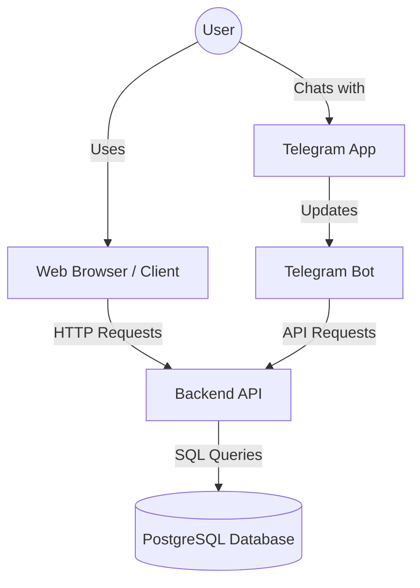

# Ko'chatim - Greenhouse Management System

Ko'chatim is a comprehensive system designed to manage greenhouse inventory, sales, and analytics. It consists of three main components working together to provide a seamless experience for administrators and users.

## System Architecture

The project is divided into three distinct parts:

1.  **Frontend (Client)**: A React-based web application for visualization and management.
2.  **Backend (API)**: A Flask-based server that manages the database and business logic.
3.  **Telegram Bot**: An interactive bot for user registration and quick access.

### How They Connect



## Component Overview

### 1. Client (`/client`)
- **Tech**: React, Vite, SCSS, Recharts.
- **Purpose**: The main user interface. Displays the dashboard, inventory, sales history, and settings.
- **Key Feature**: Fully responsive (Mobile & Desktop), localized in Uzbek.
- [Read more](./client/README.md)

### 2. Backend (`/backend`)
- **Tech**: Python, Flask, Psycopg2, Gunicorn.
- **Purpose**: The central brain of the system. It exposes a REST API consumed by both the Client and the Bot.
- **Key Feature**: Handles database connections, authentication, and heavy data processing.
- [Read more](./backend/README.md)

### 3. Bot (`/bot`)
- **Tech**: Python, Aiogram, Aiohttp.
- **Purpose**: Onboarding and quick interactions.
- **Key Feature**: Automatically registers users via Telegram ID and syncs profile pictures to the system.
- [Read more](./bot/README.md)

## Deployment Guide

To deploy the full system on a server (e.g., Ubuntu):

1.  **Database**: specific PostgreSQL instance (e.g., NeonDB or local).
2.  **Backend**: Run with Gunicorn on port 8000.
    ```bash
    cd backend && gunicorn -w 4 -b 0.0.0.0:8000 app:app
    ```
3.  **Bot**: Run as a background service (Systemd).
    ```bash
    cd bot && python3 app.py
    ```
4.  **Client**: Build and serve static files (e.g., via Nginx).
    ```bash
    cd client && npm run build
    ```

## Development

- Ensure you have **Python 3.11+** and **Node.js 18+** installed.
- Configure `.env` files in each directory (`client`, `backend`, `bot`) before running.
